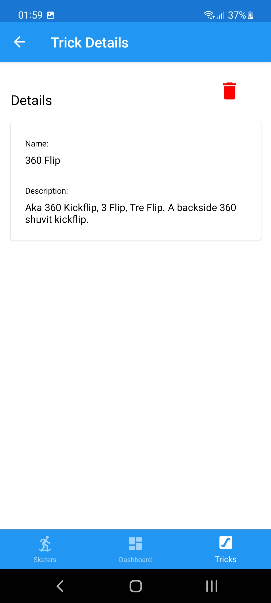

# Skateboard Never Die!

Projeto focado no estudo de SSO e uso de HATEOAS para construção de retorno de APIs mais semânticas.
## 📖 Resumo sobre SSO e HATEOAS
**Single Sign-On (SSO)** centraliza o processo de autenticação das aplicações e traz mais segurança ao processo de login e acesso de recursos de APIs.

**Hypermedia as the Engine of Application State (HATEOAS)** o uso do retorno de de recursos da API neste padrão facilita o uso sem a necessidade de um prévio conhecimento da API. Basicamente a ideia é retornar o [recurso listando links](doc/swagger_api_response.png) de ações que podem ser executadas para o mesmo.

## 🏗️ Estrutura do Projeto
O Projeto foi estruturado seguindo as boas praticas de clean architecture e se encontra dividido em 15 projetos, como pode ser visto no print abaixo.

Para implementação do **SSO** foi utilizado a biblioteca [OpenIddict](https://github.com/openiddict) e na estruturação do retorno em **HATEOAS** a [Simple.Hateoas](https://github.com/RonildoSouza/Simple.Hateoas) que foi desenvolvida por mim.

## 🔑 Contas Para Acesso
### Senha de todas as contas **@Skateb0ard**

- admin@skateboard.com
  - Pode fazer **tudo**
- user01@skateboard.com
  - Pode **adicionar** e **remover** skaters e tricks
- user02@skateboard.com
  - Pode **adicionar** skaters e tricks

## 🔗 Links de Acesso
- API: https://skateboardneverdieservicesapi.azurewebsites.net/swagger/index.html
- SSO: https://skateboardneverdieservicessinglesignon.azurewebsites.net/login
- MOBILE (APK): 

## 🖼️ Imagens

| Sistema | Prints |
| --      | --     |
| API     |    |
| SSO     |  |
| Mobile  |    |

## 📚 Bibliotecas de Terceiros

| Nome           | Utilizada Em | Link |
| --              | -- | -- |
| OpenIddict.Abstractions             | API, MOBILE | https://www.nuget.org/packages/OpenIddict.Abstractions |
| OpenIddict.AspNetCore               | API, SSO    | https://www.nuget.org/packages/OpenIddict.AspNetCore |
| OpenIddict.EntityFrameworkCore      | SSO         | https://www.nuget.org/packages/OpenIddict.EntityFrameworkCore |
| OpenIddict.Validation.AspNetCore    | API         | https://www.nuget.org/packages/OpenIddict.Validation.AspNetCore |
| OpenIddict.Validation.SystemNetHttp | API         | https://www.nuget.org/packages/OpenIddict.Validation.SystemNetHttp |
| Simple.Hateoas                      | API         | https://www.nuget.org/packages/Simple.Hateoas |
| Hellang.Middleware.ProblemDetails   | API         | https://www.nuget.org/packages/Hellang.Middleware.ProblemDetails |
| Scrutor                             | API         | https://www.nuget.org/packages/Scrutor |
| FluentValidation                    | API         | https://www.nuget.org/packages/FluentValidation |
| Swashbuckle.AspNetCore              | API         | https://www.nuget.org/packages/Swashbuckle.AspNetCore |
| Swashbuckle.AspNetCore.Newtonsoft   | API         | https://www.nuget.org/packages/Swashbuckle.AspNetCore.Newtonsoft |
| Swashbuckle.AspNetCore.Swagger      | API         | https://www.nuget.org/packages/Swashbuckle.AspNetCore.Swagger |
| IdentityModel.OidcClient            | MOBILE      | https://www.nuget.org/packages/IdentityModel.OidcClient |
| Microcharts.Forms                   | MOBILE      | https://www.nuget.org/packages/Microcharts.Forms |
| Refit                               | MOBILE      | https://www.nuget.org/packages/Refit |